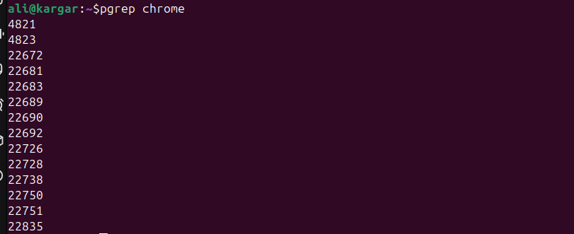

## What is a Core Dump?

A **core dump** is a special file created by the operating system when a program crashes or is explicitly instructed to dump its memory.  
It contains a snapshot of the program’s memory, processor registers, and execution state at the moment of failure.

This information is extremely valuable for:
- **Debugging crashes**: You can open the dump in a debugger like `gdb` to see the call stack, variables, and cause of the crash.
- **Post-mortem analysis**: Instead of rerunning the faulty program, developers can analyze the exact crash state offline.
- **Production systems**: Core dumps allow debugging without attaching `gdb` to a live system or reproducing the crash.

---
## Generating Core Dumps 

### 0) Enable Core Dumps

The command 
```bash
ulimit -c 
```
controls the **maximum size (in blocks)** of a core dump file that a process can create.
- `0` → core dumps are disabled.
- Any positive number → maximum size in blocks (rarely used today).
- `unlimited` → no size restriction; full core dumps will be generated when a process crashes.
This setting is **per-shell session** (and inherited by processes started from that shell).

how we can change it ? 
with using this command : 
```bash
ulimit -c unlimited 
```
Now, any program started from this shell can generate a full core dump when it crashes.  
To confirm: 
```bash
ulimit -c 
```

result : 


---
### 1) When are core dumps generated?

By default, **on unhandled fatal signals**, e.g.:
- `SIGSEGV` (invalid memory access)
- `SIGABRT` (abort)
- `SIGILL` (illegal instruction)
- `SIGFPE` (divide by zero, etc.)
- `SIGBUS` (bus error)

---

### 2) Trigger a dump using signals or with code error 

From terminal :

```bash

kill -SIGABRT <PID>    # most reliable way to force a core
# or kill -SIGSEGV <PID>  # simulates a segfault
```

Inside C code : 
```c
#include <signal.h>
#include <stdlib.h>

int main(void) {
    // Option A: abort() -> SIGABRT
    abort();

    // Option B: raise a signal
    raise(SIGSEGV);
}
```

example : 


---

### 3) Where does the core get saved?

**A) Classic kernel → file path :**  
The file `/proc/sys/kernel/core_pattern` defines where and how core dumps are saved.

```bash
cat /proc/sys/kernel/core_pattern
```


- Can include patterns such as:
  - `%e` → executable filename  
  - `%p` → PID  
  - `%t` → timestamp  
  
**B) systemd‑coredump (default on many distros):**

`core_pattern` is a **pipe** to `systemd-coredump`, and dumps go to the **journal** and (optionally) to disk under:
```/var/lib/systemd/coredump/```


Use `coredumpctl` to list/export Core Files: 


If the **COREFILE** column is empty, it means the core file has already been deleted.

---

### 4) Core Dump config file 

**systemd‑coredump approach:**

```bash
# /etc/systemd/coredump.conf 
[Coredump]
# Where to store: "external", "journal", or "none"
Storage=external
# Compression on/off:
Compress=yes
# Size & housekeeping:
ProcessSizeMax=32G
ExternalSizeMax=32G
JournalSizeMax=767M
#MaxUse=
#KeepFree=
```

after changing apply : 
```bash
sudo systemctl restart systemd-coredump
```

---
### 5) Real example: “Crash” Google Chrome and get a core
First Pid of chrome should be found using this command : 
```bash
pgrep chrome
```

This lists all Chrome processes (browser, renderers, GPU, etc.).



Then the process could be terminated by specific signal like SIGABRT with this command : 
```bash
kill -SIGABRT <PID>   # or use kill -6 <PID>
```

**example :**


as you can see the chrome crashed after killing the process and then using `coredumpctl` command could see that core dump generated . 
Example:


---

## Reading Core Dumps 

### 0) What is an ELF file? What’s inside a core?

**ELF** (Executable and Linkable Format) is how Linux stores binaries, libraries, and cores.  
A **core file** is an ELF that stores:
- The crashing process’s **memory segments** (selected by kernel filters),
- **Register state** per thread,
- **Auxiliary vectors**, **PRSTATUS** notes, etc.

as you can see the core file is an ELF file . 

---
### 1) Read the core file using GDB 

**Classic invocation:** 
```bash
gdb /path/to/exe /path/to/core
```

in GDB some deatils can be check like where and why the program crashed : 


**Via systemd-coredump (auto-locates exe & symbols):**

```bash
coredumpctl gdb <PID or /path/to/exe or TIME>
```

**Inside gdb (useful commands):**

```gdb
thread apply all bt full        # backtraces for all threads with locals
info threads
frame 0                         # jump to top frame of the crashing thread
info registers
info proc mappings              # memory maps
p some_variable
x/16gx $rsp                     # examine memory around stack pointer (x86-64 example)
list                             # show source if available
```

---
## Manipulating Core Dumps

### 1) Exporting, deleting (systemd‑coredump)
```bash
# Export to a file (ELF core) from the journal:
coredumpctl dump <PID> -o /path_to_save/core.myapp.$PID

# Remove old dumps (interactive):
coredumpctl delete

```

### 2) Live process snapshots (no crash) with `gcore`

The `gcore` tool, part of GDB, creates a core dump of a running process **without crashing** it, useful for debugging live applications. Run :
```bash
gcore -o /tmp/myapp-core <PID> 
```
to generate /tmp/myapp-core., capturing the process's memory state.
Debug it with:
```bash
gdb /proc/<PID>/exe /tmp/myapp-core.<PID>
```
to analyze variables, stack, and threads. This allows non-intrusive inspection of a process's state.

### 3) Control what memory goes into a core

You can **trim or expand** what the kernel includes in cores via a bitmask:

```bash
# Show current mask
cat /proc/self/coredump_filter

# Example: include anonymous private(1), anonymous shared(2), file-backed private(4),
# file-backed shared(8), ELF headers(0x10), hugepages private(0x20)...
```

for example in this coredump_filter file : 


```c
0x33 = 0b00110011
```

So in this case, bits **0, 1, 4, 5** are set.
- Bit 0 → include anonymous private memory
- Bit 1 → include anonymous shared memory
- Bit 4 → include ELF headers
- Bit 5 → include private huge pages

So this system will include **heap, shared memory, ELF headers, and private hugepages** in the core dumps.

---

##  Related Resources

- **Linux core dump documentation**  
  [linux core dump file](https://www.man7.org/linux/man-pages/man5/core.5.html)

- **systemd-coredump manual**  
  [systemd-coredump(8)](https://www.freedesktop.org/software/systemd/man/latest/systemd-coredump.html)

- **Signals in Linux**  
  [man 7 signal](https://man7.org/linux/man-pages/man7/signal.7.html)

- **GDB (GNU Debugger) documentation**  
  [GDB Official Documentation](https://man7.org/linux/man-pages/man1/gdb.1.html)


---
